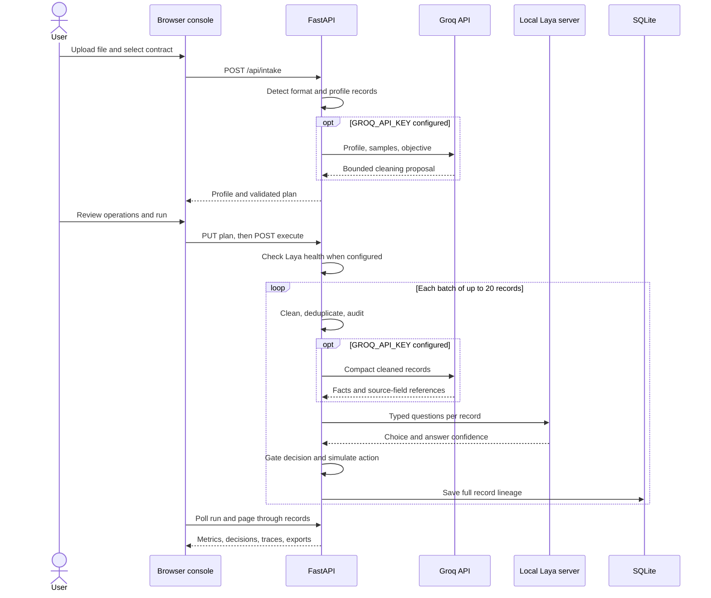
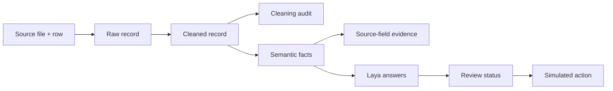

# Universal Adaptive Data Classifier

**UADC** is a local data operations console for classifying text and tabular datasets. It turns uploaded files into traceable records, profiles their contents, applies a reviewable cleaning plan, extracts concise facts, asks [Laya](https://github.com/NandhaKishorM/laya) constrained questions, and presents the resulting decisions in a browser and exportable reports.

The interface uses plain HTML, CSS, and JavaScript. The backend uses FastAPI and SQLite. [Groq](https://console.groq.com/docs/structured-outputs) powers the optional cleaning planner and semantic extraction; Laya runs as a separate local decision service.

> **Project status:** functional local MVP for text and tabular data. It supports guided classification through explicit contracts. Automatic taxonomy discovery, document extraction, multimodal inputs, and production deployment controls are future work.

## Contents

- [How it works](#how-it-works)
- [Quick start](#quick-start)
- [Using the console](#using-the-console)
- [Supported data and limits](#supported-data-and-limits)
- [Classification contracts](#classification-contracts)
- [Decision and review policy](#decision-and-review-policy)
- [Data lineage and exports](#data-lineage-and-exports)
- [API](#api)
- [Project structure](#project-structure)
- [Testing](#testing)
- [Operational notes](#operational-notes)

## How it works

UADC separates deterministic data processing from semantic interpretation and model decisions. Groq proposes transformations from a compact profile; the application validates those proposals against an allowlist and executes the operations itself. It never executes Python produced by an LLM.

```mermaid
flowchart LR
    A["File upload<br/>HTML / CSS / JS console"] --> B["Format adapter<br/>record iterator"]
    B --> C["Dataset profile<br/>samples + field statistics"]
    C --> D["Groq cleaning planner<br/>optional"]
    D --> E["Validate operation spec"]
    E --> F["Deterministic cleaning<br/>exact deduplication + audit"]
    F --> G["Groq fact extraction<br/>batches of 20; optional"]
    G --> H["Canonical facts<br/>field-level evidence"]
    H --> I["Laya typed questions<br/>local HTTP service"]
    I --> J["Confidence gate<br/>review status"]
    J --> K["Mock action policy"]
    K --> L["SQLite run store"]
    L --> M["Explorer + CSV / JSON / XLSX"]
    C -. "No Groq key or request fails" .-> N["Deterministic plan"]
    N --> E
    F -. "No Groq key or request fails" .-> O["Field passthrough"]
    O --> H
    H -. "LAYA_URL empty" .-> P["Clearly marked rule demo<br/>no model confidence"]
    P --> J
```



One run has two deliberate steps: **analyze**, which produces a profile and editable cleaning plan, and **execute**, which processes records. This lets the user inspect transformations before they run.



## Quick start

### Requirements

- Python 3.10 or newer; Python 3.11 is recommended.
- A Groq API key for LLM planning and fact extraction.
- The optional local Laya service for model decisions. Its first launch may download a checkpoint.

The app can run without Groq or Laya for a limited, clearly marked demo. With `LAYA_URL` configured but the service offline, execution stops before processing any records.

### Windows PowerShell

From the project directory:

```powershell
py -3.11 -m venv .venv
.\.venv\Scripts\python.exe -m pip install -r requirements.txt
.\.venv\Scripts\python.exe -m pip install -r requirements-laya.txt
Copy-Item .env.example .env
```

Edit `.env` and set `GROQ_API_KEY`. For full Laya processing, set `LAYA_URL=http://127.0.0.1:8001` as well. The application reads this file with `python-dotenv`; no shell environment variables are required.

Start Laya in terminal 1:

```powershell
.\.venv\Scripts\python.exe laya_server.py
```

Start UADC in terminal 2:

```powershell
.\.venv\Scripts\python.exe -m uvicorn app:app --host 127.0.0.1 --port 8000
```

Open **http://127.0.0.1:8000**. API documentation is available at **http://127.0.0.1:8000/docs**.

### macOS and Linux

```bash
python3 -m venv .venv
.venv/bin/python -m pip install -r requirements.txt
.venv/bin/python -m pip install -r requirements-laya.txt
cp .env.example .env
```

Edit `.env` as above, then run `.venv/bin/python laya_server.py` and `.venv/bin/python -m uvicorn app:app --host 127.0.0.1 --port 8000` in separate terminals.

### Configuration

| Variable | Purpose | Default in `.env.example` |
| --- | --- | --- |
| `GROQ_API_KEY` | Enables LLM planning and fact extraction | Empty; deterministic fallbacks |
| `GROQ_MODEL` | Groq chat model | `openai/gpt-oss-120b` |
| `LAYA_URL` | Origin of the Laya HTTP service | Empty; rule demo mode |
| `LAYA_API_KEY` | Bearer token if the Laya service requires one | Empty |
| `LAYA_MODEL` | Checkpoint requested by UADC; `auto` delegates routing to Laya | `multilingual` |

`laya_server.py` loads `.env` and starts a localhost service on port 8001 by default. It uses CPU inference and preloads the multilingual checkpoint. To change those server defaults, see the launcher and the [Laya server configuration](https://github.com/NandhaKishorM/laya#self-hosting-http-server-jev-compatible).

## Using the console

1. **Select a classifier** and upload a supported file. The classifier determines the question and available labels; the file format alone does not determine the classification task.
2. **Review the profile**: record count, fields, missing values, estimated duplicates, and a source sample.
3. **Review the cleaning plan**. Uncheck operations you do not want, then run the pipeline.
4. **Inspect the result**: every record shows raw data, cleaned data, semantic facts, evidence, Laya's decision, review status, and simulated action.
5. **Export** a CSV, JSON package, or Excel workbook. If Laya failed during a previous run and is now online, use **Retry failed Laya decisions** to classify the saved semantic states without uploading or interpreting the data again.

The console flags a recognized chess PGN file paired with a customer-text classifier. A PGN file is grouped into games, but a dedicated chess classification contract is not bundled.

## Supported data and limits

| Input | Record boundary | Notes |
| --- | --- | --- |
| CSV / TSV | One data row | CSV delimiter detection; UTF-8 text |
| JSON | Array item, or one object; also accepts a top-level `records` array | JSON files over 20 MB should be converted to JSONL |
| JSONL | One JSON value per nonempty line | Malformed lines are counted and rejected during execution |
| XLSX | One row per worksheet, after its header | Read-only workbook iteration; source sheet and row retained |
| TXT / LOG / Markdown | One nonempty line | Use a structured format when a logical record spans many lines |
| PGN, including detected PGN in `.txt` | One chess game | Tags and move text become fields |

Uploads are capped at **100 MB**. CSV, TSV, JSONL, XLSX, and PGN records are read iteratively. The profiler bounds its duplicate sample at 100,000 hashes; the displayed duplicate count is an estimate for larger datasets. Execution uses a SQLite fingerprint table for exact deduplication of cleaned records. The current Excel writer builds a workbook in memory, so large exports need additional memory. This MVP is not yet benchmarked for million-record runs.

## Classification contracts

Contracts live in [`classifiers/`](classifiers/) as JSON files. The bundled examples are [`support.json`](classifiers/support.json) for customer support routing and [`sentiment.json`](classifiers/sentiment.json) for text sentiment. The browser requires the user to select a contract explicitly.

Each contract freezes its labels, typed questions, review thresholds, and simulated destinations for a run. To add a task, create another JSON file with this shape:

```json
{
  "id": "topic-router-v1",
  "name": "Topic router",
  "description": "Route a message by topic.",
  "primary_question": "topic",
  "questions": {
    "topic": {
      "type": "choice",
      "instructions": "Which topic best describes this message?",
      "criteria": {
        "orders": "orders, shipping, delivery",
        "returns": "returns, refunds, exchanges",
        "other": "anything outside those topics"
      }
    }
  },
  "thresholds": {
    "auto_approve": 0.85,
    "needs_review": 0.60
  },
  "actions": {
    "orders": "/mock/topics/orders",
    "returns": "/mock/topics/returns",
    "other": "/mock/topics/general"
  }
}
```

The `primary_question` must be a `choice` question with at least two labels. Additional Laya questions can use its supported typed primitives; their answers are retained in the decision trace. Contract files are trusted local configuration and should be reviewed before use.

## Decision and review policy

UADC gates the primary Laya choice using **answer confidence**, meaning the probability of the reported label. Laya also returns a separate distribution concentration field named `confidence`; UADC retains that value for inspection but does not use it for the review gate. See the [Laya HTTP response guidance](https://github.com/NandhaKishorM/laya#self-hosting-http-server-jev-compatible).

| Answer confidence | Default status | Simulated action |
| --- | --- | --- |
| `>= 0.85` | `AUTO_APPROVED` | Mock request and response recorded |
| `0.60` to `< 0.85` | `NEEDS_REVIEW` | Not sent |
| `< 0.60` | `UNRESOLVED` | Not sent |
| Unavailable or Laya error | Review or unresolved | Not sent |

Thresholds come from each contract. They are examples, **not validated calibration thresholds**. Before real automation, evaluate accuracy and calibration on labeled data from the target task. UADC never calls a real downstream action endpoint; `/mock/...` paths are shown as simulation artifacts only.

When `LAYA_URL` is empty, a lexical rule demo may produce a label. It never reports model confidence or auto-approves an action.

## Data lineage and exports

Each stored result links the source row to the cleaned record, semantic facts, field-level evidence, decision, review outcome, mock action, and cleaning audit. Run metadata and profile are saved as JSON; processed records are saved in SQLite under `data/runs/`.



CSV and JSON exports stream records from SQLite. The XLSX export contains these 11 sheets:

| Sheet | Content |
| --- | --- |
| `01_Dashboard` | Run totals and classification distribution chart |
| `02_Classifications` | Labels, confidence, engine, review, action |
| `03_Data_Quality` | Field profile and missing values |
| `04_Confidence` | Per-record model confidence and status |
| `05_Cleaning_Audit` | Original and transformed field values |
| `06_Semantic_State` | Facts and supporting evidence |
| `07_API_Actions` | Simulated request and response |
| `08_Review_Queue` | Records requiring review |
| `09_Errors` | Classification errors |
| `10_Dataset_Profile` | Source metadata and profile summary |
| `11_Run_Metadata` | Run ID, timestamps, contract, plan |

## API

FastAPI exposes interactive OpenAPI documentation at `/docs`.

| Method | Path | Purpose |
| --- | --- | --- |
| `GET` | `/api/config` | Available contracts, formats, Groq setup, Laya health |
| `POST` | `/api/intake` | Upload and profile a file; create a cleaning plan |
| `GET` | `/api/runs/{run_id}` | Run status, profile, plan, metrics, summary |
| `PUT` | `/api/runs/{run_id}/plan` | Save allowed cleaning operations before execution |
| `POST` | `/api/runs/{run_id}/execute` | Start background processing |
| `GET` | `/api/runs/{run_id}/records` | Page through records; optional review filter |
| `POST` | `/api/runs/{run_id}/retry-laya` | Retry stored Laya errors after service recovery |
| `GET` | `/api/runs/{run_id}/export/{format}` | Download `csv`, `json`, or `xlsx` |

## Project structure

```text
app.py                  FastAPI routes and static UI hosting
laya_server.py          Local Laya launcher; reads .env
classifiers/            Frozen classification contracts
static/                 HTML, CSS, and JavaScript console
uadc/ingest.py          Format adapters and profiler
uadc/cleaning.py        Validated cleaning operations and audit
uadc/llm.py             Groq planner and semantic interpreter
uadc/decision.py        Laya client, fallback demo, gating, mock actions
uadc/pipeline.py        Run lifecycle, SQLite storage, streamed exports
uadc/export.py          Excel workbook generator
tests/                  Unit and API workflow tests
data/uploads/           Uploaded source files; ignored by Git
data/runs/              Run metadata, SQLite files, exports; ignored by Git
```

## Testing

```powershell
.\.venv\Scripts\python.exe -m unittest discover -s tests -v
```

The tests cover the CSV-to-Excel flow, review gating, rejected cleaning operations, the Laya response contract, offline preflight, and PGN record grouping. A live Groq key and Laya checkpoint are needed for full integration testing; the unit suite does not download models.

## Operational notes

- **Credentials and data:** `.env` is ignored by Git. Uploaded files, profile samples, and cleaned records may contain sensitive information. With Groq enabled, profile samples and compact record batches are sent to Groq; Laya receives semantic facts at the configured service URL. Review your data policy before using real records.
- **Local scope:** run the app on `127.0.0.1`. The development server has no user authentication, tenancy, or production access controls.
- **Offline Laya:** `LAYA_URL` is a configured destination, not proof of a running server. Start `laya_server.py`, confirm `/health`, and refresh the UI. The app rejects new execution while a configured Laya server is unreachable.
- **Task fit:** confidence cannot make an unrelated contract meaningful. Choose labels that match the data and objective. A recognized PGN file with either bundled customer-text contract is rejected before processing; older runs show a warning.
- **Recovery:** a completed run containing `laya_error` decisions can retry classification from saved semantic facts. Groq interpretation and cleaning are not repeated.
- **Current limits:** the operation allowlist is intentionally small; LLM-generated Python, automatic taxonomy discovery, PDFs, images, audio, video, real API actions, and production-scale export controls are not implemented.
